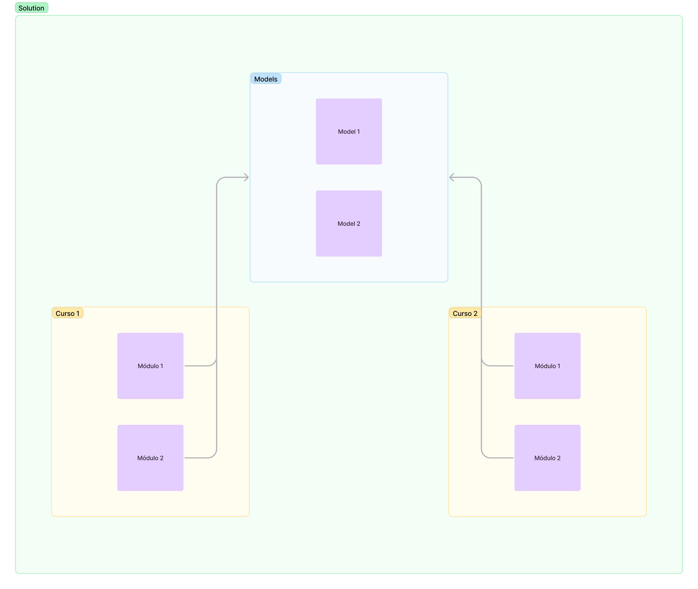

# Formação .NET Developer

### Detalhes da formação

> Domine a principal stack de desenvolvimento da Microsoft e torne-se um profissional de destaque no mercado quando o assunto se trata de criar soluções na plataforma .NET.

- 👉 Durante a sua jornada você vai aprender como desenvolver em APIs robustas para criar aplicações de alto nível, testes unitários para criar aplicações resilientes, banco de dados relacional e não relacionais (SQL e NoSQL) na prática e ainda exercite seus conhecimentos na Azure: um dos principais provedores de serviços em nuvem do mundo.

- ⚠️ Pré-requisitos: Conhecimentos básicos em Lógica de Programação e Pensamento Computacional

### Para reestruturação das pastas foi criado um diagrama para verificar como ficaria essa hierarquia de pastas e arquivos dos Cursos da Formação .Net

- Formação .Net
    - Cursos
        - Módulos
    - Models

